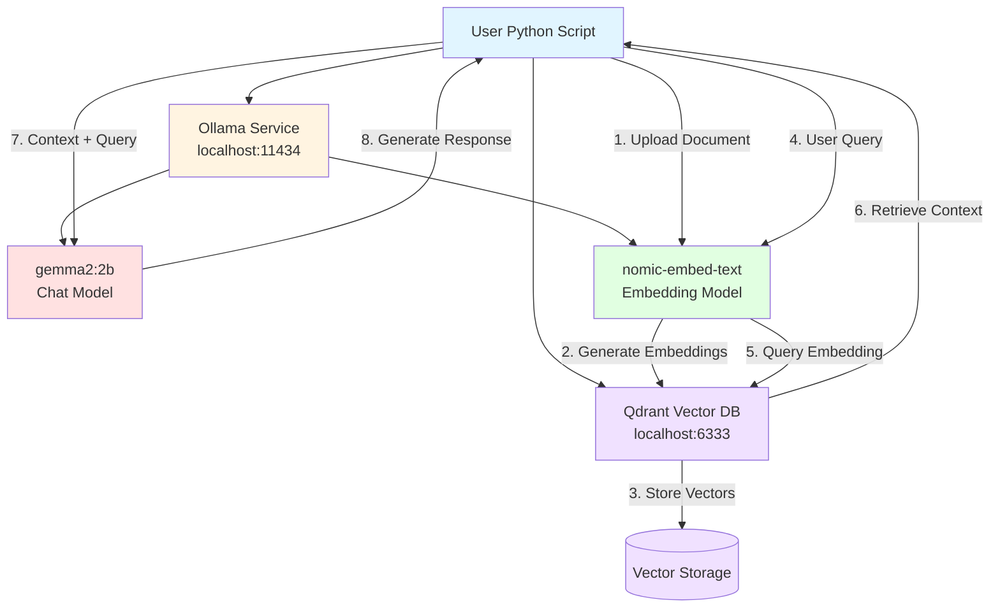

# Local LLM with RAG Setup Guide

This setup prioritizes practicality and understanding over UI polish. Build your own tools, experiment directly with the APIs, and maintain full control over your RAG pipeline.

## Architecture Overview



## System Requirements

- Ubuntu 22.04 or later
- 32GB RAM minimum
- 100GB free disk space
- Docker installed

## Step 1: Install Docker

```bash
# Update package list
sudo apt update

# Install Docker
sudo apt install docker.io -y

# Add your user to docker group
sudo usermod -aG docker $USER

# Reboot to apply group changes
sudo reboot
```

After reboot, verify Docker:
```bash
docker ps
```

## Step 2: Install Ollama

```bash
# Install Ollama using official script
curl -fsSL https://ollama.com/install.sh | sh

# Configure Ollama to listen on all interfaces
sudo systemctl edit ollama.service
```

Add these lines in the editor:
```
[Service]
Environment="OLLAMA_HOST=0.0.0.0:11434"
```

Save (Ctrl+X, Y, Enter), then restart:
```bash
sudo systemctl daemon-reload
sudo systemctl restart ollama
sudo systemctl status ollama
```

## Step 3: Pull Ollama Models

```bash
# Pull chat model (2B for better performance on older hardware)
ollama pull gemma2:2b

# Pull embedding model
ollama pull nomic-embed-text

# Verify models
ollama list
```

## Step 4: Install Qdrant Vector Database

```bash
# Create persistent storage volume
docker volume create qdrant_storage

# Run Qdrant container
docker run -d \
  -p 6333:6333 \
  -p 6334:6334 \
  -v qdrant_storage:/qdrant/storage:z \
  --name qdrant \
  --restart always \
  qdrant/qdrant

# Verify Qdrant is running
curl http://localhost:6333
```

## Step 5: Setup Python Virtual Environment

```bash
# Create project directory
mkdir /home/$USER/rag-project
cd /home/$USER/rag-project

# Create virtual environment
python3 -m venv venv

# Activate virtual environment
source venv/bin/activate

# Install required Python libraries
pip install ollama qdrant-client
```

## Step 6: Test the Setup

Create a test script:
```bash
nano test_rag.py
```

Paste this content:
```python
import ollama
from qdrant_client import QdrantClient

# Test Ollama connection
print("Testing Ollama connection...")
response = ollama.chat(model='gemma2:2b', messages=[
    {'role': 'user', 'content': 'What is 2+2?'}
])
print(f"Ollama response: {response['message']['content']}")

# Test Qdrant connection
print("\nTesting Qdrant connection...")
client = QdrantClient("localhost", port=6333)
collections = client.get_collections()
print(f"Qdrant collections: {collections}")

print("\n✓ Setup successful!")
```

Run the test:
```bash
python test_rag.py
```

Expected response time: 10-30 seconds depending on hardware.

## Step 7: Basic RAG Example

Create a simple RAG script:
```bash
nano simple_rag.py
```

Paste this content:
```python
import ollama
from qdrant_client import QdrantClient
from qdrant_client.models import Distance, VectorParams, PointStruct
import uuid

# Initialize clients
qdrant = QdrantClient("localhost", port=6333)
collection_name = "documents"

# Create collection if it doesn't exist
try:
    qdrant.create_collection(
        collection_name=collection_name,
        vectors_config=VectorParams(size=768, distance=Distance.COSINE),
    )
    print(f"✓ Created collection: {collection_name}")
except Exception as e:
    if "already exists" in str(e):
        print(f"✓ Collection {collection_name} already exists")
    else:
        print(f"Collection error: {e}")

# Sample document
document = "The capital of France is Paris. It is known for the Eiffel Tower."

# Generate embedding
print("Generating embedding...")
embedding_response = ollama.embeddings(model='nomic-embed-text', prompt=document)
embedding = embedding_response['embedding']

# Store in Qdrant
point_id = str(uuid.uuid4())
qdrant.upsert(
    collection_name=collection_name,
    points=[
        PointStruct(
            id=point_id,
            vector=embedding,
            payload={"text": document}
        )
    ]
)
print(f"✓ Stored document with ID: {point_id}")

# Query the document
query = "What is the capital of France?"
print(f"\nQuery: {query}")

# Generate query embedding
query_embedding_response = ollama.embeddings(model='nomic-embed-text', prompt=query)
query_embedding = query_embedding_response['embedding']

# Search Qdrant
hits = qdrant.query_points(
    collection_name=collection_name,
    query=query_embedding,
    limit=1
)
search_results = [hit.payload for hit in hits.points] if hits.points else []

# Get context from search results
context = search_results[0]['text'] if search_results else ""

# Generate response with context
print("Generating response...")
chat_response = ollama.chat(
    model='gemma2:2b',
    messages=[
        {
            'role': 'user',
            'content': f'Context: {context}\n\nQuestion: {query}\n\nAnswer based on the context:'
        }
    ]
)

print(f"\n✓ Response: {chat_response['message']['content']}")
```

Run it:
```bash
python simple_rag.py
```

## Project Structure

```
/home/$USER/rag-project/
├── venv/                    # Virtual environment
├── test_rag.py             # Connection test script
├── simple_rag.py           # Basic RAG example
└── documents/              # Store your documents here (create as needed)
```

## Working with the Environment

**Activate environment:**
```bash
cd /home/$USER/rag-project
source venv/bin/activate
```

**Deactivate when done:**
```bash
deactivate
```

## Verify Services are Running

```bash
# Check Ollama
systemctl status ollama

# Check Qdrant
docker ps | grep qdrant

# Test Ollama API
curl http://localhost:11434/api/tags

# Test Qdrant API
curl http://localhost:6333/collections
```

## Troubleshooting

### Error: externally-managed-environment
If you still see the "externally-managed-environment" error inside the venv, for example:
```text:
This environment is externally managed
╰─> To install Python packages system-wide, try apt install
    python3-xyz, where xyz is the package you are trying to
    install.
```

Then, install full Python tooling and recreate the venv.
```bash
# 1. Deactivate current venv
deactivate 2>/dev/null || true

# 2. Install full Python tool
sudo apt install python3-full

# 3. Back in your project
cd ~/projects/local-llm-with-rag

# 4. Remove the old venv
rm -rf venv

# 5. Recreate venv with the fully featured Python
python3 -m venv venv

# 6. Activate it
source venv/bin/activate

# 7. Now install packages inside the venv
python3 -m pip install --upgrade pip setuptools wheel
python3 -m pip install ollama qdrant-client
```

### Slow responses
- Expected on older hardware (2012 iMac: 20-40 seconds per query)
- Use `gemma2:2b` instead of larger models
- Consider upgrading hardware or using cloud services

### Ollama connection refused
```bash
sudo systemctl restart ollama
```

### Qdrant not accessible
```bash
docker restart qdrant
```

### Python import errors
```bash
source venv/bin/activate
pip install --upgrade ollama qdrant-client
```

## Performance Expectations

On 2012 iMac (Core i5, 32GB RAM):
- Document embedding: 1-3 seconds
- RAG query (with retrieval): 20-40 seconds
- Direct chat (no RAG): 10-20 seconds

## Next Steps

1. Experiment with different chunk sizes for documents
2. Test different embedding models
3. Build custom retrieval strategies
4. Integrate with your own applications

## Stopping Services

```bash
# Stop Ollama
sudo systemctl stop ollama

# Stop Qdrant
docker stop qdrant

# Remove Qdrant (data persists in volume)
docker rm qdrant
```

## Complete Cleanup

```bash
# Remove Qdrant container and data
docker stop qdrant
docker rm qdrant
docker volume rm qdrant_storage

# Uninstall Ollama
sudo systemctl stop ollama
sudo systemctl disable ollama
sudo rm /usr/local/bin/ollama
sudo rm -rf /usr/share/ollama
sudo rm /etc/systemd/system/ollama.service

# Remove project
rm -rf /home/$USER/rag-project
```

---
