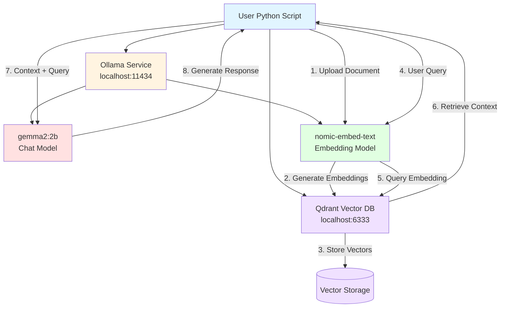

# Local LLM with RAG Setup Guide

This setup prioritizes practicality and understanding over UI polish. Build your own tools, experiment directly with the APIs, and maintain full control over your RAG pipeline.

## Architecture Overview



## System Requirements

- Ubuntu 22.04 or later
- 32GB RAM minimum
- 100GB free disk space
- Docker installed

## Step 1: Install Docker

```bash
# Update package list
sudo apt update

# Install Docker
sudo apt install docker.io -y

# Add your user to docker group
sudo usermod -aG docker $USER

# Reboot to apply group changes
sudo reboot
```

After reboot, verify Docker:
```bash
docker ps
```

## Step 2: Install Ollama

```bash
# Install Ollama using official script
curl -fsSL https://ollama.com/install.sh | sh

# Configure Ollama to listen on all interfaces
sudo systemctl edit ollama.service
```

Add these lines in the editor:
```
[Service]
Environment="OLLAMA_HOST=0.0.0.0:11434"
```

Save (Ctrl+X, Y, Enter), then restart:
```bash
sudo systemctl daemon-reload
sudo systemctl restart ollama
sudo systemctl status ollama
```

## Step 3: Pull Ollama Models

```bash
# Pull chat model (2B for better performance on older hardware)
ollama pull gemma2:2b

# Pull embedding model
ollama pull nomic-embed-text

# Verify models
ollama list
```

## Step 4: Install Qdrant Vector Database

```bash
# Create persistent storage volume
docker volume create qdrant_storage

# Run Qdrant container
docker run -d \
  -p 6333:6333 \
  -p 6334:6334 \
  -v qdrant_storage:/qdrant/storage:z \
  --name qdrant \
  --restart always \
  qdrant/qdrant

# Verify Qdrant is running
curl http://localhost:6333
```

## Step 5: Setup Python Virtual Environment

```bash
# Create project directory
mkdir /home/$USER/rag-project
cd /home/$USER/rag-project

# Create virtual environment
python3 -m venv venv

# Activate virtual environment
source venv/bin/activate

# Install required Python libraries
pip install ollama qdrant-client
```

## Step 6: Test the Setup

Create a test script:
```bash
nano test_rag.py
```

Paste this content:
```python
import ollama
from qdrant_client import QdrantClient

# Test Ollama connection
print("Testing Ollama connection...")
response = ollama.chat(model='gemma2:2b', messages=[
    {'role': 'user', 'content': 'What is 2+2?'}
])
print(f"Ollama response: {response['message']['content']}")

# Test Qdrant connection
print("\nTesting Qdrant connection...")
client = QdrantClient("localhost", port=6333)
collections = client.get_collections()
print(f"Qdrant collections: {collections}")

print("\n✓ Setup successful!")
```

Run the test:
```bash
python test_rag.py
```

Expected response time: 10-30 seconds depending on hardware.

## Step 7: Dynamic OER Ingestion (PositivePsychology.com RSS)

This step adds **daily, dynamic ingestion** of Open Educational Resources (OER) from PositivePsychology.com into your local Qdrant RAG corpus. The script:

- Polls the RSS feed.
- Extracts article metadata and text.
- Embeds each article via Ollama (`nomic-embed-text`).
- Upserts embeddings + payloads into your Qdrant collection.

### 7.1 Install RSS / parsing dependencies

From inside your Ubuntu project venv:

```bash
cd ~/projects/local-llm-rag-qdrant-ubuntu
source venv/bin/activate

pip install feedparser beautifulsoup4 requests trafilatura
```

### 7.2 OER ingestion script

Create a new file `oer_ingest.py` in your project:

```python
import feedparser
import requests
import trafilatura
import hashlib
import uuid
from datetime import datetime
from time import mktime
import re

from qdrant_client import QdrantClient
from qdrant_client.http import models
import ollama

QDRANT_HOST = "localhost"
QDRANT_PORT = 6333
COLLECTION_NAME = "psych_oer"

# PositivePsychology.com RSS (wellbeing / psychology OER) [rss.feedspot](https://rss.feedspot.com/positive_psychology_rss_feeds/)
RSS_URL = "https://positivepsychology.com/feed/"

client = QdrantClient(QDRANT_HOST, port=QDRANT_PORT)

def ensure_collection():
    if not client.collection_exists(COLLECTION_NAME):
        client.create_collection(
            collection_name=COLLECTION_NAME,
            vectors_config=models.VectorParams(
                size=768,  # nomic-embed-text output dimension [ollama](https://ollama.com/library/nomic-embed-text)
                distance=models.Distance.COSINE,
            ),
        )
        print(f"Created collection '{COLLECTION_NAME}'")
    else:
        print(f"Collection '{COLLECTION_NAME}' already exists")

def clean_html(text: str) -> str:
    text = text or ""
    text = re.sub(r"<[^>]+>", "", text)
    text = re.sub(r"\s+", " ", text)
    return text.strip()

def fetch_full_text(url: str) -> str:
    """
    Try to fetch and extract the main article content.
    Falls back to RSS summary if needed.
    """
    try:
        resp = requests.get(url, timeout=10)
        resp.raise_for_status()
        downloaded = trafilatura.extract(resp.text)
        if downloaded and len(downloaded) > 200:
            return downloaded
    except Exception:
        pass
    return ""

def embed_text(text: str):
    resp = ollama.embeddings(model="nomic-embed-text", prompt=text)
    return resp["embedding"]

def ingest_rss(limit: int = 10):
    ensure_collection()

    feed = feedparser.parse(RSS_URL)
    points = []

    for entry in feed.entries[:limit]:
        title = entry.title
        url = entry.link

        pub_struct = entry.get("published_parsed")
        if pub_struct:
            published = datetime.fromtimestamp(mktime(pub_struct))
        else:
            published = datetime.now()

        summary = clean_html(getattr(entry, "summary", ""))
        full_text = fetch_full_text(url) or f"{title}. {summary}"

        # Truncate to avoid huge prompts
        full_text = full_text[:6000]

        # Skip trivial content
        if len(full_text) < 200:
            print(f"Skipping very short article: {title}")
            continue

        # Deterministic ID per article
        doc_hash = hashlib.md5(f"{url}{published}".encode()).digest()
        point_id = str(uuid.UUID(bytes=doc_hash))

        # Embedding for whole article (for now; you can later chunk)
        vector = embed_text(full_text)

        payload = {
            "doc_id": url,
            "title": title,
            "url": url,
            "published": published.isoformat(),
            "source": "positivepsychology",
            "text": full_text,
            "tags": ["wellbeing", "positive_psychology"],
        }

        points.append(
            models.PointStruct(
                id=point_id,
                vector=vector,
                payload=payload,
            )
        )

        print(f"Queued: {title[:80]}...")

    if points:
        client.upsert(collection_name=COLLECTION_NAME, points=points)
        print(f"✅ Upserted {len(points)} OER articles into '{COLLECTION_NAME}'")
    else:
        print("No new articles to ingest.")

if __name__ == "__main__":
    ingest_rss(limit=10)
```

Notes:

- Uses `collection_exists` and `VectorParams(size=768)` to match `nomic-embed-text`.[web:6][web:17][web:30]
- Uses full-text extraction via **trafilatura** where possible.[web:226]
- Uses deterministic UUIDs so re-running doesn’t create duplicates.

### 7.3 Integrating into your RAG chatbot

In your existing `rag_chat.py` (Ubuntu + Qdrant version), add a **second retrieval path** for `psych_oer` or point your existing retrieval at that collection.

Example retrieval for the new collection:

```python
from qdrant_client import QdrantClient
from qdrant_client.http import models
import ollama

QDRANT_HOST = "localhost"
QDRANT_PORT = 6333
COLLECTION_NAME = "psych_oer"
EMB_MODEL = "nomic-embed-text"

client = QdrantClient(QDRANT_HOST, port=QDRANT_PORT)

def retrieve_psych_context(query: str, top_k: int = 5) -> str:
    q_emb = ollama.embeddings(model=EMB_MODEL, prompt=query)["embedding"]

    results = client.query_points(
        collection_name=COLLECTION_NAME,
        query=q_emb,
        limit=top_k,
        with_payload=True,
    ).points

    context = "Psychology OER context:\n\n"
    for i, hit in enumerate(results, 1):
        p = hit.payload
        context += f"[{i}] {p.get('title','')} ({p.get('source','')}, {p.get('published','')[:10]})\n"
        context += f"{p.get('text','')[:800]}...\n\n"
    return context
```

Then in your chat loop, you can either:

- Use *only* this context, or  
- Concatenate it with your existing local-docs context before sending to the LLM.

### 7.4 Automating daily ingestion

Add a cron job on Ubuntu so new OER articles are ingested daily:

```bash
crontab -e
```

Add:

```cron
0 3 * * * cd /home/youruser/projects/local-llm-rag-qdrant-ubuntu && /home/youruser/.pyenv/shims/python oer_ingest.py >> logs/oer_ingest.log 2>&1
```

(adjust paths for your environment / venv activation, e.g. `source venv/bin/activate && python oer_ingest.py`.)

---

## Troubleshooting

### Error: externally-managed-environment
If you still see the "externally-managed-environment" error inside the venv, for example:
```text:
This environment is externally managed
╰─> To install Python packages system-wide, try apt install
    python3-xyz, where xyz is the package you are trying to
    install.
```

Then, install full Python tooling and recreate the venv.
```bash
# 1. Deactivate current venv
deactivate 2>/dev/null || true

# 2. Install full Python tool
sudo apt install python3-full

# 3. Back in your project
cd ~/projects/local-llm-with-rag

# 4. Remove the old venv
rm -rf venv

# 5. Recreate venv with the fully featured Python
python3 -m venv venv

# 6. Activate it
source venv/bin/activate

# 7. Now install packages inside the venv
python3 -m pip install --upgrade pip setuptools wheel
python3 -m pip install ollama qdrant-client
```

### Slow responses
- Expected on older hardware (2012 iMac: 20-40 seconds per query)
- Use `gemma2:2b` instead of larger models
- Consider upgrading hardware or using cloud services

### Ollama connection refused
```bash
sudo systemctl restart ollama
```

### Qdrant not accessible
```bash
docker restart qdrant
```

### Python import errors
```bash
source venv/bin/activate
pip install --upgrade ollama qdrant-client
```

## Performance Expectations

On 2012 iMac (Core i5, 32GB RAM):
- Document embedding: 1-3 seconds
- RAG query (with retrieval): 20-40 seconds
- Direct chat (no RAG): 10-20 seconds

## Next Steps

1. Experiment with different chunk sizes for documents
2. Test different embedding models
3. Build custom retrieval strategies
4. Integrate with your own applications

## Stopping Services

```bash
# Stop Ollama
sudo systemctl stop ollama

# Stop Qdrant
docker stop qdrant

# Remove Qdrant (data persists in volume)
docker rm qdrant
```

## Complete Cleanup

```bash
# Remove Qdrant container and data
docker stop qdrant
docker rm qdrant
docker volume rm qdrant_storage

# Uninstall Ollama
sudo systemctl stop ollama
sudo systemctl disable ollama
sudo rm /usr/local/bin/ollama
sudo rm -rf /usr/share/ollama
sudo rm /etc/systemd/system/ollama.service

# Remove project
rm -rf /home/$USER/rag-project
```

---
